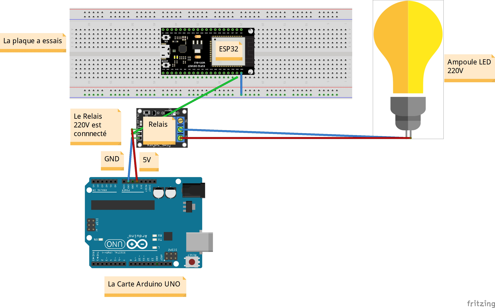

# IOT_SmartHome
Projet : Maison intelligente 
Ce code permet de contrôler un relais à partir d'un appareil externe (comme un smartphone) 
via Bluetooth en envoyant l'une des commandes prédéfinies puis en allumant un ampoules LED. Le relais est connecté au GPIO 22 de l'ESP32, et le nom de 
l'appareil Bluetooth est "Maison_Intelligent@Devnas". Le moniteur série est utilisé pour afficher des messages de démarrage et de notification.

devnas.inc@gmail.com
github: dev2nas

APK disponible sur playStore: Arduino BlueController
Copyright [void loop Robotech & Automation] & [DEVNAS]
@2023

